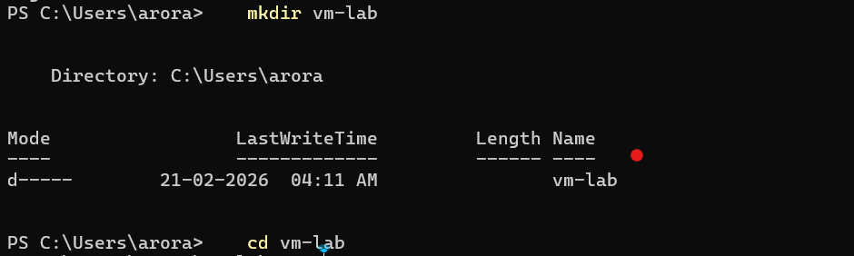
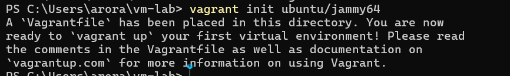
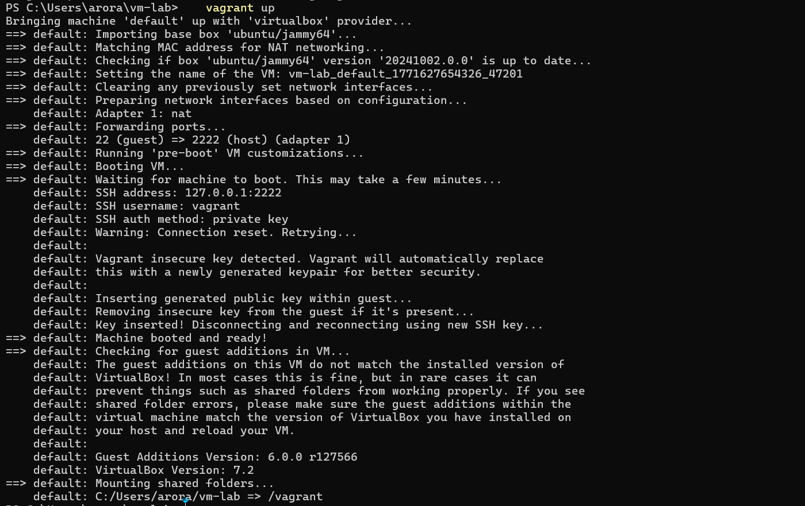
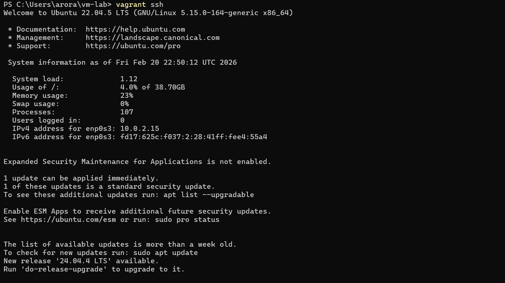
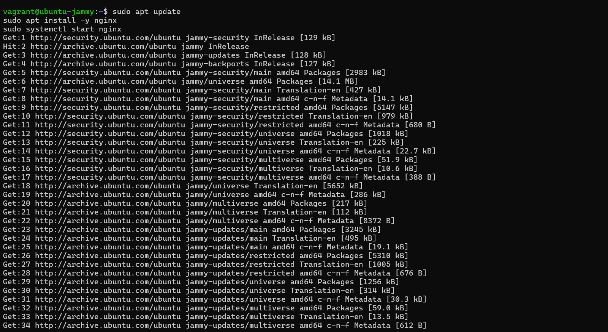
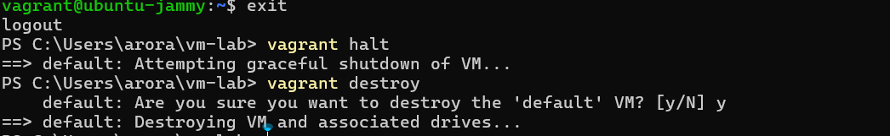

# Experiment 1

## Comparison of Virtual Machines (VMs) and Containers using Ubuntu and Nginx

---

## Objective

1. To understand the conceptual and practical differences between Virtual Machines and Containers.
2. To install and configure a Virtual Machine using VirtualBox and Vagrant on Windows.
3. To install and configure Containers using Docker inside WSL.
4. To deploy an Ubuntu-based Nginx web server in both environments.
5. To compare resource utilization, performance, and operational characteristics of VMs and Containers.


---

## Procedure

---

## Part A: Virtual Machine (Windows)

### Step 1: Install VirtualBox

1. Download VirtualBox from the official website.
2. Run the installer and keep default options.
3. Restart the system if prompted.


---

### Step 2: Install Vagrant

1. Download Vagrant for Windows.
2. Install using default settings.
3. Verify installation:

```bash
vagrant --version
```


---

### Step 3: Create Ubuntu VM using Vagrant

1. Create a new directory:

```bash
mkdir vm-lab
cd vm-lab
```



2. Initialize Vagrant with Ubuntu box:

```bash
vagrant init ubuntu/jammy64
```



3. Start the VM:

```bash
vagrant up
```



4. Access the VM:

```bash
vagrant ssh
```



---

### Step 4: Install Nginx inside VM

Install and start Nginx:

```bash
sudo apt update
sudo apt install -y nginx
sudo systemctl start nginx
```



---

### Step 5: Verify Nginx

Verify Nginx is running:

```bash
curl localhost
```


---

### Step 6: Stop and Remove VM

Stop and destroy the VM:

```bash
vagrant halt
vagrant destroy
```



---

## Part B: Containers using Docker (WSL)

### Step 1: Run Ubuntu Container with Nginx

Pull and run an Ubuntu container with Nginx:

```bash
docker run -d -p 8080:80 --name nginx-container nginx
```

### Step 2: Verify Container

Verify the container is running:

```bash
docker ps
curl localhost:8080
```

### Step 3: Stop and Remove Container

```bash
docker stop nginx-container
docker rm nginx-container
```


---

## Comparison: VMs vs Containers

| Feature | Virtual Machine | Container |
|---------|-----------------|-----------|
| **Boot Time** | Minutes | Seconds |
| **Resource Usage** | High (full OS) | Low (shared kernel) |
| **Isolation** | Complete | Process-level |
| **Image Size** | GBs | MBs |
| **Portability** | Limited | High |
| **Performance** | Near-native with overhead | Near-native |

---

## Result

Successfully installed and configured both Virtual Machine (using VirtualBox and Vagrant) and Containers (using Docker), deployed Nginx web server in both environments, and compared their resource utilization and operational characteristics.
