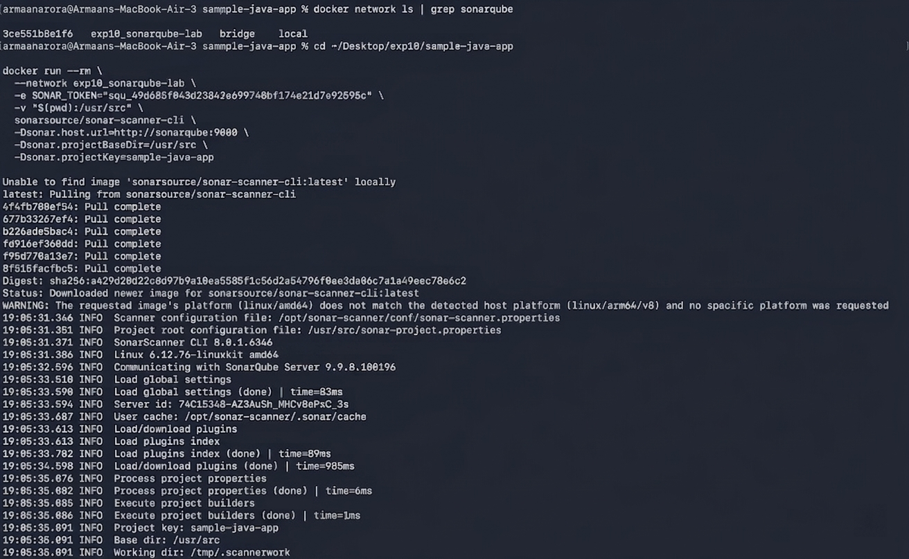
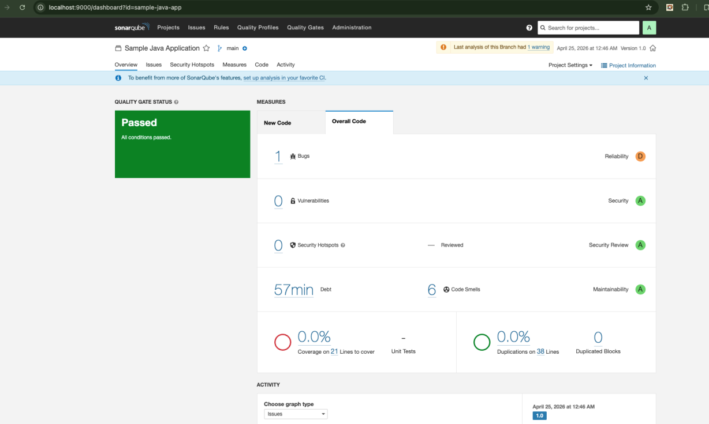

# Experiment 10: SonarQube – Static Code Analysis

## Objective

To perform static code analysis on a Java application using SonarQube to detect bugs, vulnerabilities, and code quality issues.

---

## Step 1: Start SonarQube Server

```bash id="7zt0gq"
cd ~/Desktop/exp10
docker-compose up -d
```

Check logs:

```bash id="bh9z3x"
docker-compose logs -f sonarqube
```

Verify containers:

```bash id="c7x7tf"
docker ps
```

Expected:

* sonarqube (running on port 9000)
* sonar-db (running)

**Output:**


---

## Step 2: Open SonarQube Dashboard

Open in browser:

```bash id="l4sh0c"
http://localhost:9000
```

Login:

* Username: admin
* Password: admin

Change password when prompted.

**Output:**



---

## Step 3: Generate Authentication Token

Steps:

* Go to **My Account → Security**
* Generate token: `scanner-token`

Export token:

```bash id="c3bwnu"
export SONAR_TOKEN=your_token_here
```

---

## Step 4: Prepare Sample Java Project

Navigate:

```bash id="f5n2q7"
cd ~/Desktop/exp10/sample-java-app
```

Project contains:

* `Calculator.java` (intentional bugs, smells, vulnerabilities)
* `pom.xml` (SonarQube plugin configured)

---

## Step 5: Add Token to Project

```bash id="mhhz0g"
sed -i '' "s/YOUR_TOKEN_HERE/$SONAR_TOKEN/" pom.xml
```

Verify:

```bash id="2i3p6w"
grep "sonar.login" pom.xml
```

---

## Step 6: Run SonarQube Scan

### Option A: Maven

```bash id="plk1r8"
mvn sonar:sonar -Dsonar.login=$SONAR_TOKEN
```

### Option B: Docker Scanner

```bash id="p0f8j6"
docker network ls | grep sonarqube
```

```bash id="3bdz5z"
docker run --rm \
--network exp10_sonarqube-lab \
-e SONAR_TOKEN="$SONAR_TOKEN" \
-v "$(pwd):/usr/src" \
sonarsource/sonar-scanner-cli \
-Dsonar.host.url=http://sonarqube:9000 \
-Dsonar.projectBaseDir=/usr/src \
-Dsonar.projectKey=sample-java-app
```

**Output:**


---

## Step 7: View Results

Open:

```bash id="92ujr3"
http://localhost:9000/dashboard?id=sample-java-app
```

You will see:

* Bugs
* Vulnerabilities
* Code Smells
* Quality Gate status

**Output:**



---

## Observations

* SonarQube performs static analysis without executing code
* Detects bugs, vulnerabilities, and maintainability issues
* Quality Gates enforce code standards
* Integrates easily with CI/CD pipelines

---

## Result

Successfully analyzed a Java application using SonarQube and identified code quality issues.

---

## Conclusion

SonarQube is an effective tool for continuous code quality monitoring and integrates well into DevOps pipelines.

---

## Author

* Name: Armaan Arora
* SAP ID: 500124414
