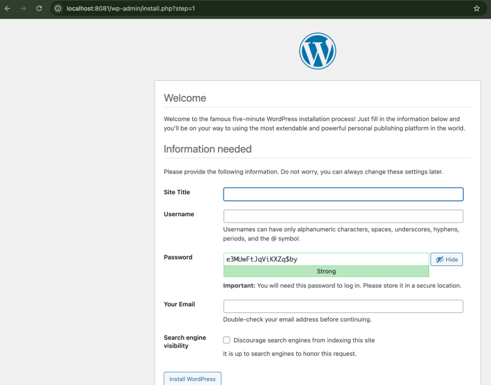

# Experiment 11: Orchestration using Docker Compose & Docker Swarm

## Objective

To understand container orchestration by deploying an application using Docker Swarm, scaling services, and observing self-healing behavior.

---

## Prerequisites

* Docker installed
* Swarm mode enabled
* `docker-compose.yml` file (WordPress + MySQL setup from previous experiment)

---

## Task 1: Initialize Docker Swarm

```bash id="4q1v3c"
docker swarm init
docker node ls
```

This initializes the current machine as a **Swarm manager node**.

---

## Task 2: Deploy Application as a Stack

```bash id="h4v4p1"
docker stack deploy -c docker-compose.yml wpstack
```

This deploys services using the Compose file in Swarm mode.

**Output:**


---

## Task 3: Verify Deployment

```bash id="p1hz2q"
docker service ls
```

```bash id="q9u2mw"
docker service ps wpstack_wordpress
```

```bash id="8yj3k2"
docker ps
```

These commands confirm that services and containers are running under Swarm.

**Output:**


---

## Task 4: Access WordPress Application

Open in browser:

```text id="u4mj7c"
http://localhost:8081
```

You should see the WordPress setup page.

**Output:**



---

## Task 5: Scale the Application

```bash id="5n8gkt"
docker service scale wpstack_wordpress=3
```

This increases WordPress replicas from **1 → 3**.

Verify:

```bash id="6u8d1w"
docker service ls
docker service ps wpstack_wordpress
docker ps | grep wordpress
```

**Output:**


---

## Task 6: Test Self-Healing

Step 1: Find a container

```bash id="v5m9zt"
docker ps | grep wordpress
```

Step 2: Kill a container

```bash id="0o9u4m"
docker kill <container-id>
```

Step 3: Verify automatic recovery

```bash id="d3k9sa"
docker service ps wpstack_wordpress
docker ps | grep wordpress
```

Swarm automatically replaces the failed container to maintain desired replicas.

**Output:**


---

## Task 7: Remove the Stack

```bash id="1w7k2l"
docker stack rm wpstack
docker service ls
docker ps
```

This removes all services and containers created by the stack.

---

## Observations

* Docker Swarm enables orchestration across multiple containers
* Services manage containers automatically
* Scaling is achieved by adjusting replica count
* Swarm provides built-in load balancing
* Self-healing ensures system reliability

---

## Result

Successfully deployed, scaled, and managed a multi-container application using Docker Swarm.

---

## Conclusion

Docker Swarm simplifies container orchestration by providing features like scaling, load balancing, and automatic recovery, making it suitable for distributed environments.

---

## Author

* Name: Armaan Arora
* SAP ID: 500124414
