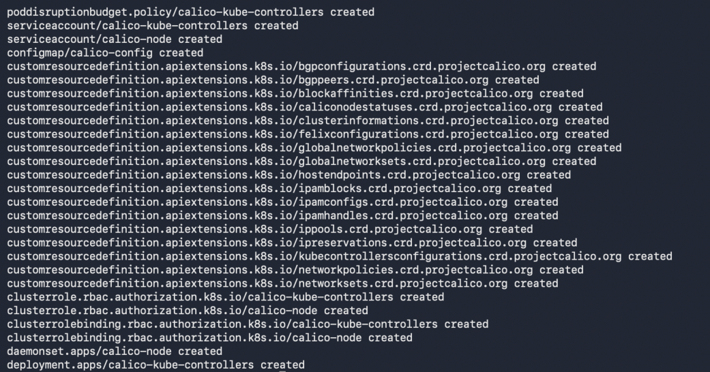
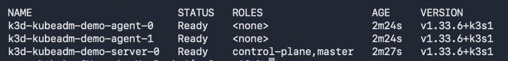
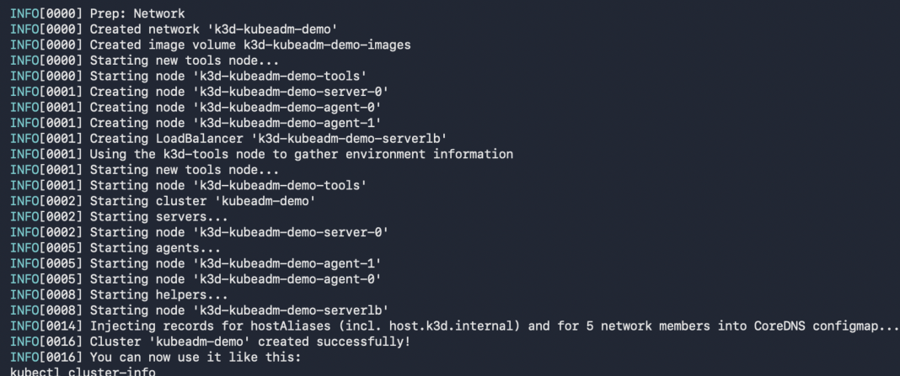
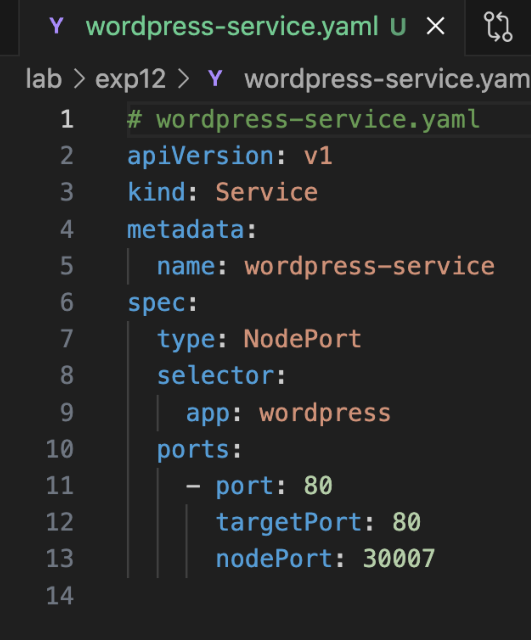
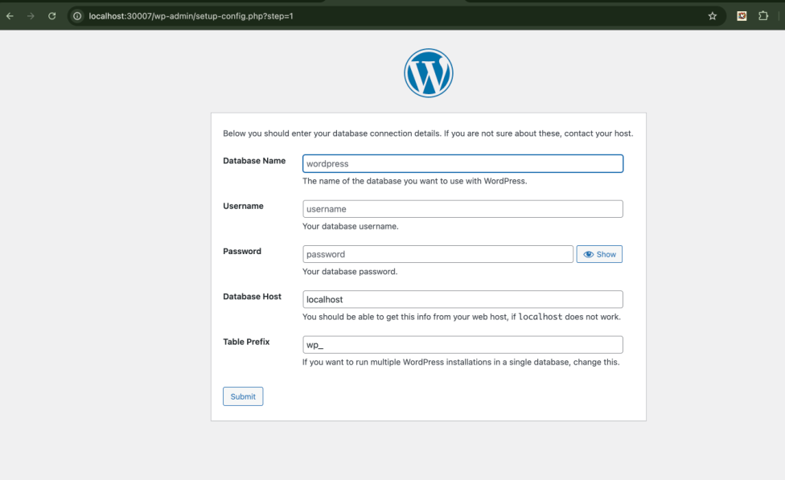
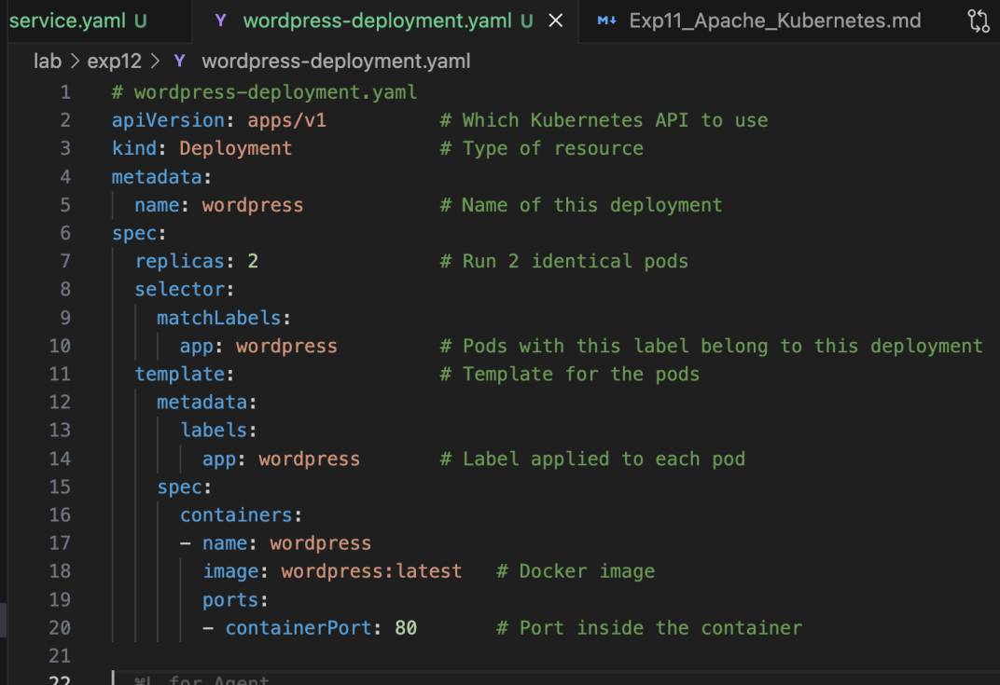

# Experiment 12: Kubernetes – Container Orchestration

## Objective

To deploy, expose, scale, and verify an application using Kubernetes.

---

## Step 1: Create Deployment File

Created `wordpress-deployment.yaml`:

```yaml
apiVersion: apps/v1
kind: Deployment
metadata:
  name: wordpress
spec:
  replicas: 2
  selector:
    matchLabels:
      app: wordpress
  template:
    metadata:
      labels:
        app: wordpress
    spec:
      containers:
      - name: wordpress
        image: wordpress:latest
        ports:
        - containerPort: 80
```

**Screenshot:**



---

## Step 2: Create Service File

Created `wordpress-service.yaml`:

```yaml
apiVersion: v1
kind: Service
metadata:
  name: wordpress-service
spec:
  type: NodePort
  selector:
    app: wordpress
  ports:
  - port: 80
    targetPort: 80
    nodePort: 30007
```

**Screenshot:**



---

## Step 3: Apply Deployment

```bash
kubectl apply -f wordpress-deployment.yaml
kubectl get pods
```

Pods are created and running.

**Screenshot:**



---

## Step 4: Create Kubernetes Cluster (k3d)

```bash
k3d cluster create kubeadm-demo
```

Cluster setup and nodes initialized.

**Screenshot:**



---

## Step 5: Network & Components Setup (Calico, etc.)

System components and CRDs initialized:

```bash
kubectl apply -f <network-config>
```

**Screenshot:**



---

## Step 6: Verify Cluster Nodes

```bash
kubectl get nodes
```

Shows:

* control-plane node
* agent nodes

**Screenshot:**


---

## Step 7: Access Application

Open in browser:

```text
http://localhost:30007
```

WordPress setup page is displayed.

**Screenshot:**



---

## Observations

* Kubernetes manages application using **Deployments and Services**
* Pods are automatically created and maintained
* NodePort exposes application externally
* Cluster consists of multiple nodes (control-plane + agents)

---

## Result

Successfully deployed and accessed a WordPress application using Kubernetes.

---

## Conclusion

Kubernetes provides scalable and reliable container orchestration with automated deployment and service exposure.

---

## Author

* Name: Armaan Arora
* SAP ID: 500124414
