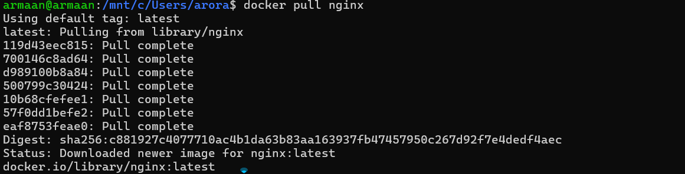
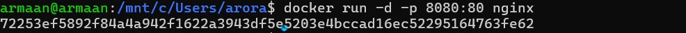
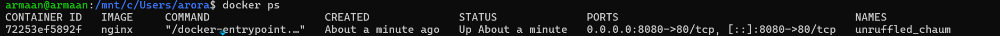
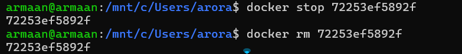
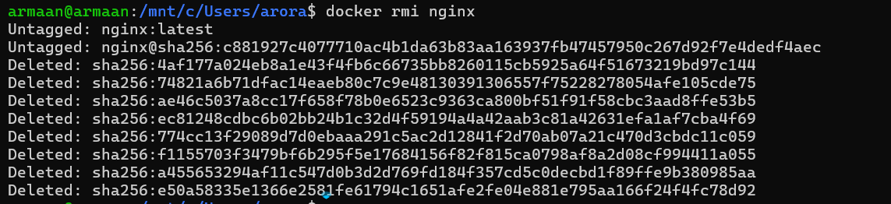

# Experiment 2

## Docker Installation, Configuration, and Running Images

---

## Objective

- Pull Docker images
- Run containers
- Manage container lifecycle

---

## Procedure

### Step 1: Pull Image

Pull the nginx image from Docker Hub:

```bash
docker pull nginx
```



---

### Step 2: Run Container with Port Mapping

Run the nginx container in detached mode with port mapping (host port 8080 to container port 80):

```bash
docker run -d -p 8080:80 nginx
```



---

### Step 3: Verify Running Containers

List all running containers:

```bash
docker ps
```



---

### Step 4: Stop and Remove Container

Stop and remove the container using its container ID:

```bash
docker stop <container_id>
docker rm <container_id>
```



---

### Step 5: Remove Image

Remove the nginx image from local storage:

```bash
docker rmi nginx
```



---

## Result

Docker images were successfully pulled, containers executed, and lifecycle commands performed.
