# Experiment 3

## Comparing NGINX Deployment: Official Image vs Custom Builds (Ubuntu & Alpine)

---

## Objective

- Deploy NGINX using official Docker image
- Build custom NGINX images using Ubuntu and Alpine base images
- Compare image sizes and layers
- Perform functional tasks with NGINX containers

---

## Procedure

---

## Part 1: Deploy NGINX Using Official Image (Recommended Approach)

### Step 1: Pull the Image

Pull the official nginx image from Docker Hub:

```bash
docker pull nginx:latest
```

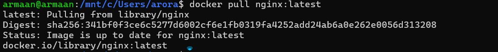

---

### Step 2: Run the Container

Run the nginx container in detached mode with a custom name and port mapping:

```bash
docker run -d --name nginx-official -p 8080:80 nginx
```


---

### Step 3: Verify

Verify the container is running by accessing it:

```bash
curl http://localhost:8080
```

You should see the NGINX welcome page.

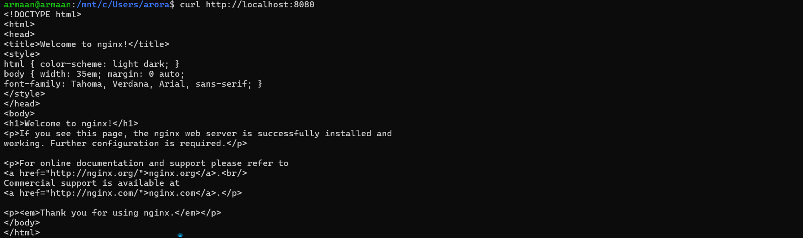

---

### Key Observations

Check the nginx image details:

```bash
docker images nginx
```

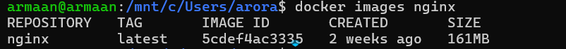

- Image is pre-optimized
- Minimal configuration required
- Uses Debian-based OS internally

---

## Part 2: Custom NGINX Using Ubuntu Base Image

### Step 1: Create Dockerfile

Create a Dockerfile with Ubuntu as the base image:

```dockerfile
FROM ubuntu:22.04

RUN apt-get update && \
    apt-get install -y nginx && \
    apt-get clean && \
    rm -rf /var/lib/apt/lists/*

EXPOSE 80

CMD ["nginx", "-g", "daemon off;"]
```


---

### Step 2: Build Image

Build the custom nginx image:

```bash
docker build -t nginx-ubuntu .
```

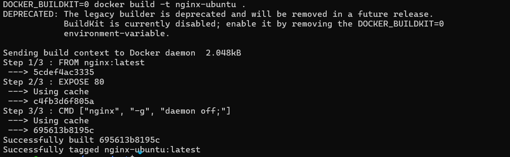

---

### Step 3: Run Container

Run the container with a different port:

```bash
docker run -d --name nginx-ubuntu -p 8081:80 nginx-ubuntu
```

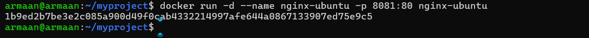

---

### Observations

Check the custom image size:

```bash
docker images nginx-ubuntu
```

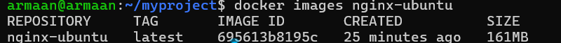

- Much larger image size
- More layers
- Full OS utilities available

---

## Part 3: Custom NGINX Using Alpine Base Image

### Step 1: Create Dockerfile

Create a Dockerfile with Alpine as the base image:

```dockerfile
FROM alpine:latest

RUN apk add --no-cache nginx

EXPOSE 80

CMD ["nginx", "-g", "daemon off;"]
```

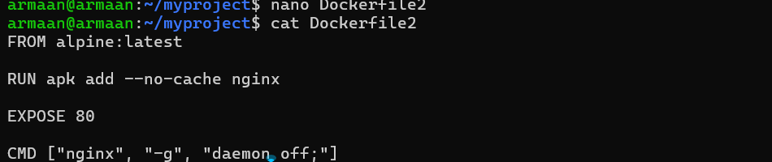

---

### Step 2: Build Image

Build the Alpine-based nginx image:

```bash
docker build -t nginx-alpine .
```


---

### Step 3: Run Container

Run the container with another port:

```bash
docker run -d --name nginx-alpine -p 8082:80 nginx-alpine
```

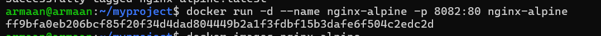

---

### Observations

Check the Alpine-based image size:

```bash
docker images nginx-alpine
```

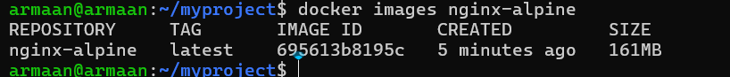

- Extremely small image
- Fewer packages
- Faster pull and startup time

---

## Part 4: Image Size and Layer Comparison

### Compare Sizes

Compare all nginx image sizes:

```bash
docker images | grep nginx
```

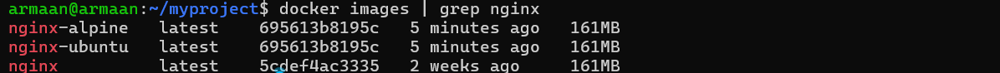

Typical result (approx):

| Image Type    | Size       |
|---------------|------------|
| nginx:latest  | ~140 MB    |
| nginx-ubuntu  | ~220+ MB   |
| nginx-alpine  | ~25-30 MB  |

---

### Inspect Layers

Inspect the layers of each image:

```bash
docker history nginx
docker history nginx-ubuntu
docker history nginx-alpine
```

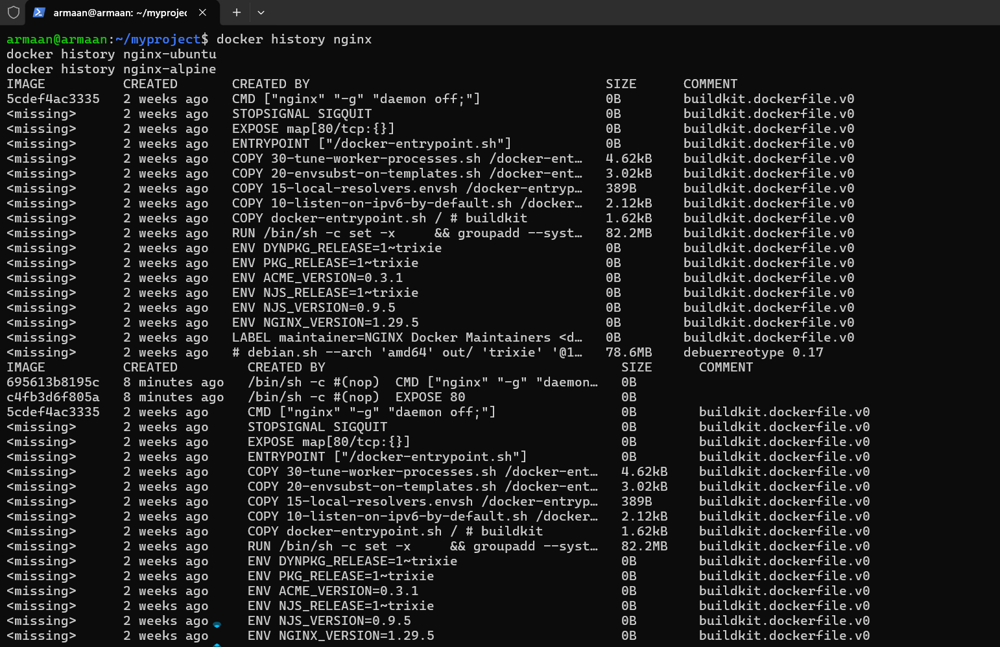

Observations:

- Ubuntu has many filesystem layers
- Alpine has minimal layers
- Official NGINX image is optimized but heavier than Alpine

---

## Part 5: Functional Tasks Using NGINX

### Task 1: Serve Custom HTML Page

Create a custom HTML file and mount it to the container:

```bash
mkdir html
echo "<h1>Hello from Docker NGINX</h1>" > html/index.html
```

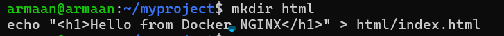

Run the container with volume mount:

```bash
docker run -d \
  -p 8083:80 \
  -v $(pwd)/html:/usr/share/nginx/html \
  nginx
```

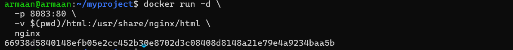

---

### Task 2: Reverse Proxy (Conceptual)

NGINX can:

- Forward traffic to backend services
- Load balance multiple containers
- Terminate SSL

Example use cases:

- Frontend for microservices
- API gateway
- Static file server

---

## Result

Successfully deployed NGINX using official image, built custom images using Ubuntu and Alpine base images, compared their sizes and layers, and performed functional tasks including serving custom HTML content.
