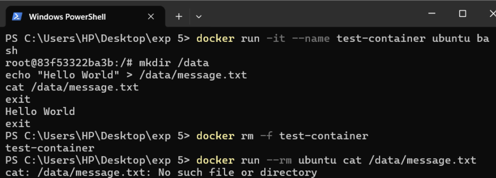
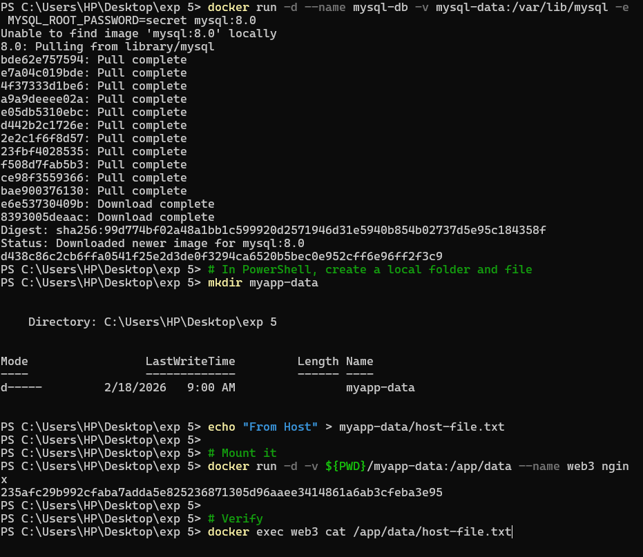
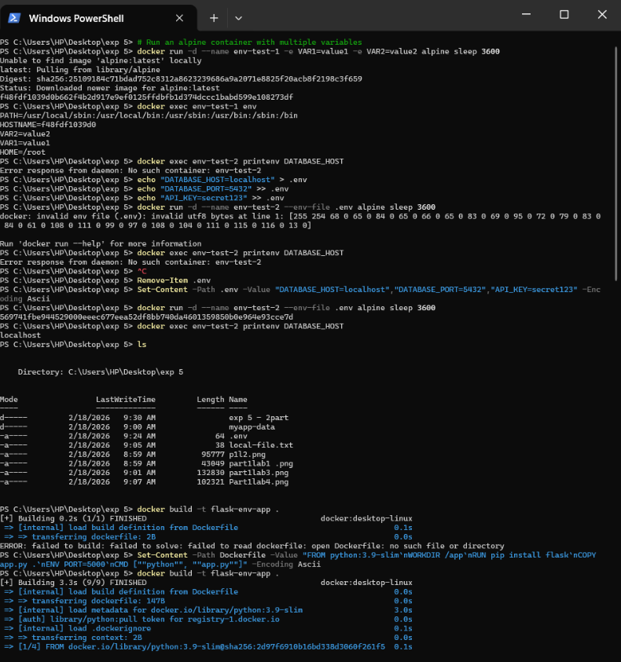
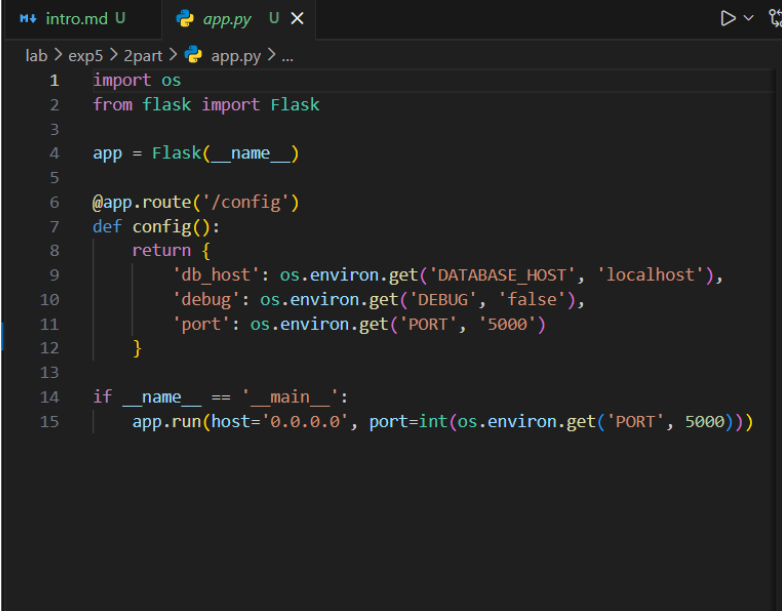
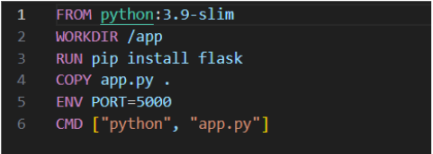
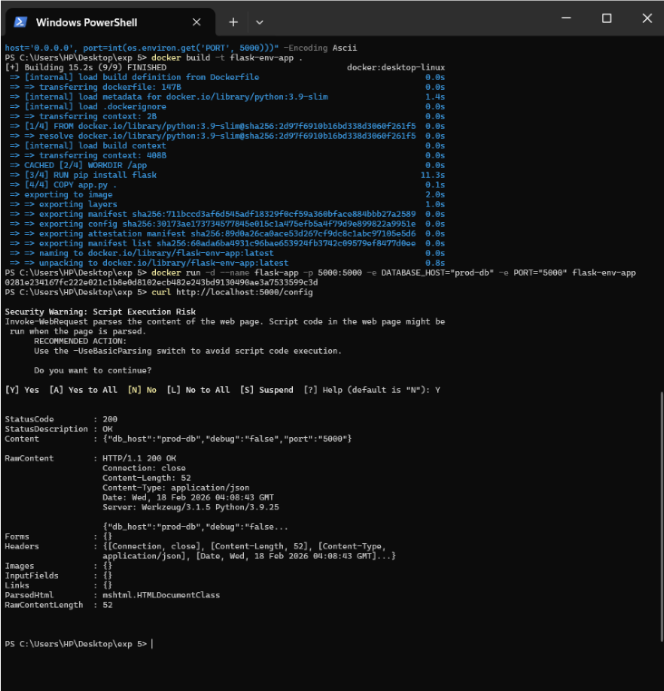
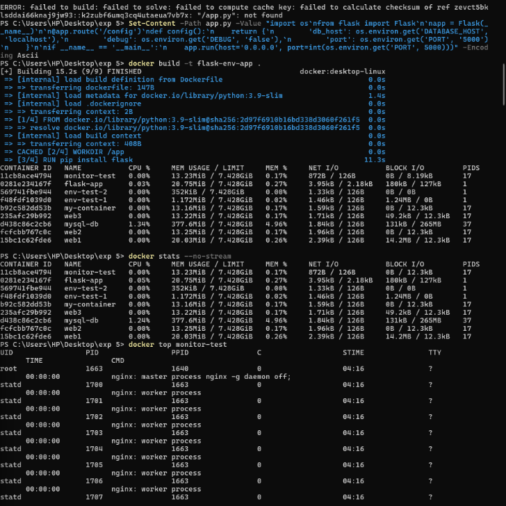
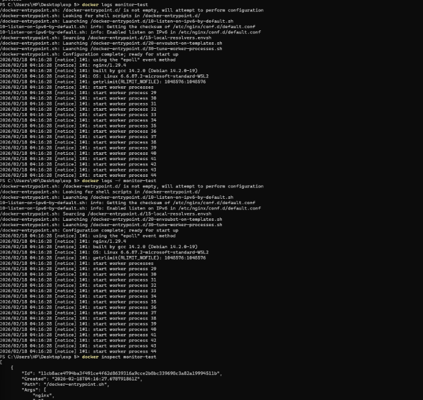

# Experiment 5: Docker – Volumes, Environment Variables, Monitoring & Networks

## Objective

To understand Docker volumes for persistent storage, environment variables for configuration, monitoring tools, and networking between containers.

---

## Part 1: Docker Volumes – Data Persistence

### Step 1: Demonstrating Ephemeral Nature of Containers

```bash
docker run -it --name test-container ubuntu bash
mkdir /data
echo "Hello World" > /data/message.txt
cat /data/message.txt
exit

docker rm -f test-container
docker run --rm ubuntu cat /data/message.txt
```

### Observation

Data created inside the container is lost after container removal.


---

### Step 2: Using Named Volume with MySQL

```bash
docker run -d --name mysql-db -v mysql-data:/var/lib/mysql -e MYSQL_ROOT_PASSWORD=secret mysql:8.0
```

### Observation

Docker pulls the MySQL image and attaches a persistent volume.



---

### Step 3: Bind Mount (Host ↔ Container)

```bash
mkdir myapp-data
echo "From Host" > myapp-data/host-file.txt

docker run -d -v ${PWD}/myapp-data:/app/data --name web3 nginx
docker exec web3 cat /app/data/host-file.txt
```

### Observation

File created on host is accessible inside container.



---

## Part 2: Environment Variables

### Step 4: Passing Variables using `-e` and `.env`

```bash
docker run -d --name env-test-1 -e VAR1=value1 -e VAR2=value2 alpine sleep 3600

echo "DATABASE_HOST=localhost" > .env
echo "DATABASE_PORT=5432" >> .env

docker run -d --name env-test-2 --env-file .env alpine sleep 3600
docker exec env-test-2 printenv DATABASE_HOST
```

### Observation

Environment variables are successfully injected into containers.



---

### Step 5: Flask Application using Environment Variables

#### app.py

```python
import os
from flask import Flask

app = Flask(__name__)

@app.route('/config')
def config():
    return {
        'db_host': os.environ.get('DATABASE_HOST', 'localhost'),
        'debug': os.environ.get('DEBUG', 'false'),
        'port': os.environ.get('PORT', '5000')
    }

if __name__ == '__main__':
    app.run(host='0.0.0.0', port=int(os.environ.get('PORT', 5000)))
```

#### Dockerfile

```dockerfile
FROM python:3.9-slim
WORKDIR /app
RUN pip install flask
COPY app.py .
ENV PORT=5000
CMD ["python", "app.py"]
```

### Build & Run

```bash
docker build -t flask-env-app .
docker run -d --name flask-app -p 5000:5000 -e DATABASE_HOST="prod-db" flask-env-app
curl http://localhost:5000/config
```

### Observation

Application reads environment variables correctly.



---

## Part 3: Docker Monitoring

### Step 6: Monitoring Containers

```bash
docker stats --no-stream
docker top container-name
docker logs monitor-test
docker inspect monitor-test
```

### Observation

* `docker stats` shows CPU and memory usage
* `docker top` shows running processes
* `docker logs` shows container logs




---

## Part 4: Docker Networking

### Step 7: Host Network

```bash
docker run -d --name host-app --network host nginx
docker exec host-app curl http://localhost
```

### Observation

Container directly uses host network and serves default nginx page.



---

### Step 8: Container Communication & Network Debugging

```bash
docker exec container-name ping -c 2 another-container
docker network inspect myapp-network
```

### Observation

Containers can communicate within the same network using container names.



---

## Conclusion

* Docker volumes ensure **data persistence**
* Environment variables enable **dynamic configuration**
* Monitoring tools help in **resource and log tracking**
* Docker networks enable **inter-container communication**

---

## Result

Successfully implemented and verified Docker volumes, environment variables, monitoring tools, and networking concepts using practical commands and examples.
