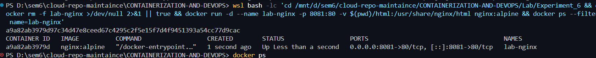
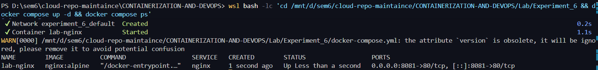
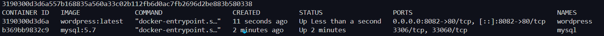
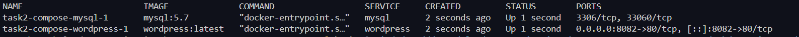
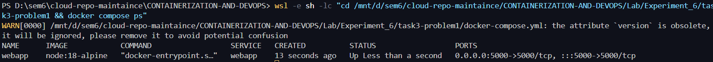
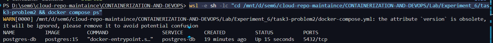
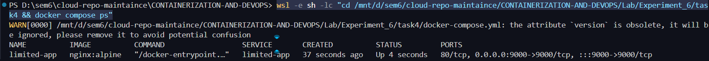
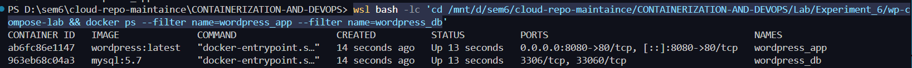
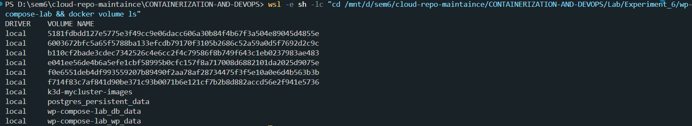
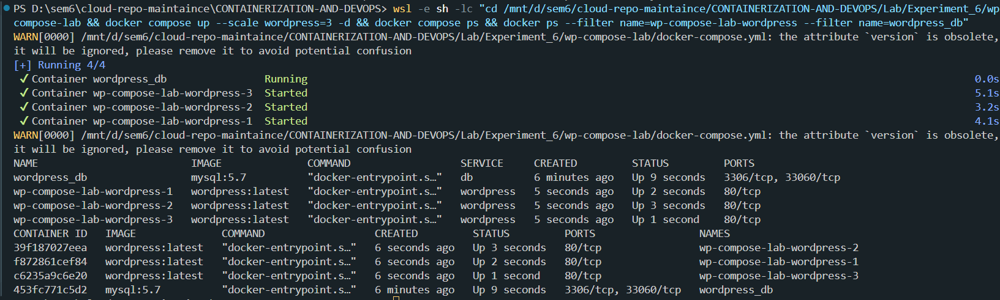

# Experiment 6
## Docker Run vs Docker Compose and Multi-Container Applications

### Objective
This experiment compares manual container management using `docker run` with declarative orchestration using Docker Compose. It also demonstrates converting run commands into compose files, building custom images with Dockerfiles, and handling a full WordPress + MySQL setup with scaling and basic Docker Swarm operations.

### Part A: Theory — Docker Run vs Docker Compose
`docker run` is useful for quick, single-container execution, but it becomes hard to maintain for multi-container setups. Docker Compose centralizes configuration in YAML, improves repeatability, and simplifies lifecycle commands.

| Docker Run Flag | Purpose | Docker Compose Equivalent |
|---|---|---|
| `--name` | Assign container name | `container_name:` |
| `-p host:container` | Publish ports | `ports:` |
| `-e KEY=VALUE` | Environment variables | `environment:` |
| `-v host:container` | Bind/volume mount | `volumes:` |
| `--network` | Attach to network | `networks:` |
| `--restart` | Restart policy | `restart:` |
| `--memory`, `--cpus` | Resource limits | `deploy.resources.limits:` |
| `--depends-on` (manual ordering) | Startup dependency | `depends_on:` |

### Part B: Practical Tasks

#### Task 1: Single Container — Nginx
This task demonstrates serving static HTML with Nginx first using `docker run`, then using Compose. The Compose method is cleaner because the same config can be reused with one command.

Docker Run approach:
```bash
docker rm -f lab-nginx >/dev/null 2>&1 || true
docker run -d --name lab-nginx -p 8081:80 -v $(pwd)/html:/usr/share/nginx/html nginx:alpine
docker ps --filter name=lab-nginx
```



Docker Compose approach (`docker-compose.yml`):
```yaml
version: "3.8"
services:
  nginx:
    image: nginx:alpine
    container_name: lab-nginx
    ports:
      - "8081:80"
    volumes:
      - ./html:/usr/share/nginx/html
```

Run and verify:
```bash
docker compose up -d
docker compose ps
```



#### Task 2: Multi-Container — WordPress + MySQL
This task sets up a typical two-tier application. MySQL provides persistence while WordPress connects using environment variables and startup dependency.

Docker Run approach:
```bash
docker network create wp-net || true
docker volume create mysql_data

docker run -d --name mysql --network wp-net \
  -e MYSQL_ROOT_PASSWORD=secret \
  -e MYSQL_DATABASE=wordpress \
  -v mysql_data:/var/lib/mysql \
  mysql:5.7

docker run -d --name wordpress --network wp-net \
  -p 8082:80 \
  -e WORDPRESS_DB_HOST=mysql \
  -e WORDPRESS_DB_PASSWORD=secret \
  wordpress:latest

docker ps --filter name=mysql --filter name=wordpress
```



Docker Compose approach (`task2-compose/docker-compose.yml`):
```yaml
version: "3.8"
services:
  mysql:
    image: mysql:5.7
    environment:
      MYSQL_ROOT_PASSWORD: secret
      MYSQL_DATABASE: wordpress
    volumes:
      - mysql_data:/var/lib/mysql
  wordpress:
    image: wordpress:latest
    ports:
      - "8082:80"
    environment:
      WORDPRESS_DB_HOST: mysql
      WORDPRESS_DB_PASSWORD: secret
    depends_on:
      - mysql
volumes:
  mysql_data:
```

Run and verify:
```bash
cd task2-compose
docker compose up -d
docker compose ps
```



### Part C: Conversion Tasks

#### Task 3 Problem 1: Basic Web App Conversion
A single `docker run` command for a Node image is converted to Compose with equivalent port, environment, and restart behavior. This improves readability and reusability.

Original Docker Run command:
```bash
docker run -d --name webapp -p 5000:5000 \
  -e APP_ENV=production -e DEBUG=false \
  --restart unless-stopped node:18-alpine
```

Equivalent Compose (`task3-problem1/docker-compose.yml`):
```yaml
version: '3.8'
services:
  webapp:
    image: node:18-alpine
    container_name: webapp
    ports:
      - '5000:5000'
    environment:
      APP_ENV: production
      DEBUG: 'false'
    restart: unless-stopped
```

```bash
cd task3-problem1
docker compose up -d
docker compose ps
```



#### Task 3 Problem 2: Volume + Network Configuration
This conversion includes custom network and persistent data volume. Compose handles dependency and common network wiring with much less manual effort.

Original Docker Run commands:
```bash
docker network create app-net || true
docker volume create pgdata

docker run -d --name postgres-db --network app-net \
  -e POSTGRES_USER=admin -e POSTGRES_PASSWORD=secret \
  -v pgdata:/var/lib/postgresql/data postgres:15

docker run -d --name backend --network app-net -p 8000:8000 \
  -e DB_HOST=postgres-db -e DB_USER=admin -e DB_PASS=secret \
  --link postgres-db:postgres-db python:3.11-slim
```

Equivalent Compose (`task3-problem2/docker-compose.yml`):
```yaml
version: '3.8'
services:
  postgres-db:
    image: postgres:15
    container_name: postgres-db
    environment:
      POSTGRES_USER: admin
      POSTGRES_PASSWORD: secret
    volumes:
      - pgdata:/var/lib/postgresql/data
    networks:
      - app-net
  backend:
    image: python:3.11-slim
    container_name: backend
    ports:
      - '8000:8000'
    environment:
      DB_HOST: postgres-db
      DB_USER: admin
      DB_PASS: secret
    depends_on:
      - postgres-db
    networks:
      - app-net
volumes:
  pgdata:
networks:
  app-net:
```

```bash
cd task3-problem2
docker compose up -d
docker compose ps
```



#### Task 4: Resource Limits Conversion
This task converts CPU and memory constraints into Compose format under `deploy.resources.limits`. It demonstrates how runtime controls can be defined declaratively.

Original Docker Run:
```bash
docker run -d --name limited-app -p 9000:9000 \
  --memory=256m --cpus=0.5 --restart=always nginx:alpine
```

Equivalent Compose (`task4/docker-compose.yml`):
```yaml
version: '3.8'
services:
  limited-app:
    image: nginx:alpine
    container_name: limited-app
    ports:
      - '9000:9000'
    restart: always
    deploy:
      resources:
        limits:
          memory: 256m
          cpus: '0.5'
```

```bash
cd task4
docker compose up -d
docker compose ps
```



### Part D: Dockerfile Build Tasks

#### Task 5: Custom Dockerfile with Compose
A simple Node HTTP app is containerized using a custom Dockerfile and then built/run through Compose. This demonstrates image build + container deployment workflow.

`app.js`
```javascript
const http = require("http");
http.createServer((req, res) => {
  res.end("Docker Compose Build Lab - Updated!");
}).listen(3000);
```

`Dockerfile`
```dockerfile
FROM node:18-alpine
WORKDIR /app
COPY app.js .
EXPOSE 3000
CMD ["node", "app.js"]
```

`docker-compose.yml`
```yaml
version: '3.8'
services:
  nodeapp:
    build:
      context: .
      dockerfile: Dockerfile
    container_name: custom-node-app
    ports:
      - '3000:3000'
```

Build and verify:
```bash
cd task5
docker compose up -d --build
docker exec custom-node-app wget -qO- http://localhost:3000
```


#### Task 6: Multi-Stage Dockerfile with Compose
A multi-stage Dockerfile is used to separate dependency preparation from runtime image creation. This gives a cleaner production layout and supports image-size optimization analysis.

`app.js`
```javascript
const http = require("http");
http.createServer((req, res) => {
  res.end("Multi-stage build - production ready!");
}).listen(3000);
```

`Dockerfile`
```dockerfile
# STAGE 1: Builder
FROM node:18-alpine AS builder
WORKDIR /app
COPY package.json .
RUN npm install --only=production && mkdir -p /app/node_modules

# STAGE 2: Runtime
FROM node:18-alpine
WORKDIR /app
COPY --from=builder /app/node_modules ./node_modules
COPY app.js .
RUN addgroup -S appgroup && adduser -S appuser -G appgroup
USER appuser
EXPOSE 3000
CMD ["node", "app.js"]
```

`docker-compose.yml`
```yaml
version: "3.8"
services:
  prodapp:
    build:
      context: .
      dockerfile: Dockerfile
    container_name: prod-node-app
    ports:
      - "3000:3000"
    environment:
      NODE_ENV: production
    volumes:
      - ./app.js:/app/app.js
```

Image size comparison:
```bash
cd task6
docker compose up -d --build
docker images | grep -E 'task|node|prod'
```


### Experiment 6B: WordPress + MySQL Full Setup

#### Architecture Overview
This setup uses two services: a MySQL database container and a WordPress application container. Named volumes ensure persistence for both database files and WordPress content across restarts.

#### Step by Step Setup
Initial Compose file (`wp-compose-lab/docker-compose.yml`):
```yaml
version: '3.9'
services:
  db:
    image: mysql:5.7
    container_name: wordpress_db
    restart: always
    environment:
      MYSQL_ROOT_PASSWORD: rootpass
      MYSQL_DATABASE: wordpress
      MYSQL_USER: wpuser
      MYSQL_PASSWORD: wppass
    volumes:
      - db_data:/var/lib/mysql
  wordpress:
    image: wordpress:latest
    container_name: wordpress_app
    depends_on:
      - db
    ports:
      - "8080:80"
    restart: always
    environment:
      WORDPRESS_DB_HOST: db:3306
      WORDPRESS_DB_USER: wpuser
      WORDPRESS_DB_PASSWORD: wppass
      WORDPRESS_DB_NAME: wordpress
    volumes:
      - wp_data:/var/www/html
volumes:
  db_data:
  wp_data:
```

Start and verify containers:
```bash
cd wp-compose-lab
docker compose up -d
docker ps --filter name=wordpress_app --filter name=wordpress_db
```



Verify named volumes:
```bash
docker volume ls
```



#### Scaling with Docker Compose
To scale WordPress, `container_name` must be removed so Compose can auto-name replicas. In local Compose mode, host port binding can also block multiple replicas, so internal `expose` is used.

Scaled WordPress service block:
```yaml
wordpress:
  image: wordpress:latest
  depends_on:
    - db
  expose:
    - "80"
  restart: always
  environment:
    WORDPRESS_DB_HOST: db:3306
    WORDPRESS_DB_USER: wpuser
    WORDPRESS_DB_PASSWORD: wppass
    WORDPRESS_DB_NAME: wordpress
  volumes:
    - wp_data:/var/www/html
```

Scale and verify:
```bash
docker compose up --scale wordpress=3 -d
docker ps --filter name=wp-compose-lab-wordpress --filter name=wordpress_db
```



Stop services:
```bash
docker compose down
```

Docker Swarm demo:
```bash
docker swarm init --advertise-addr <WSL_IP>
docker swarm leave --force
```

#### Docker Swarm Comparison Table
| Feature | Docker Compose | Docker Swarm |
|---|---|---|
| Primary Use | Local/dev multi-container orchestration | Clustered orchestration across nodes |
| Scaling | `docker compose up --scale` | `docker service scale` |
| Load Balancing | Limited/manual | Built-in routing mesh |
| Scheduling | Single host focus | Multi-node scheduling |
| Restart/HA | Basic restart policies | Service reconciliation + high availability |
| Best Fit in Lab | Fast local workflow | Intro to orchestration concepts |

### Key Takeaways
- Docker Compose significantly simplifies multi-container management compared to long `docker run` commands.
- Declarative YAML improves reproducibility, collaboration, and version control for container setups.
- For local scaling, avoid fixed `container_name` and conflicting host port bindings.
- Multi-stage Dockerfiles and Compose together improve production readiness and organization.
- Docker Swarm introduces cluster-level orchestration concepts beyond local Compose workflows.
