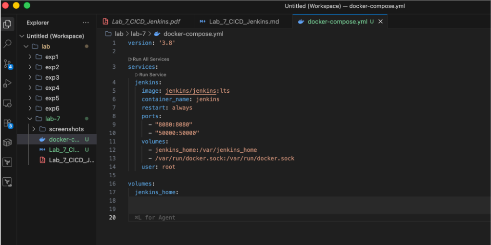
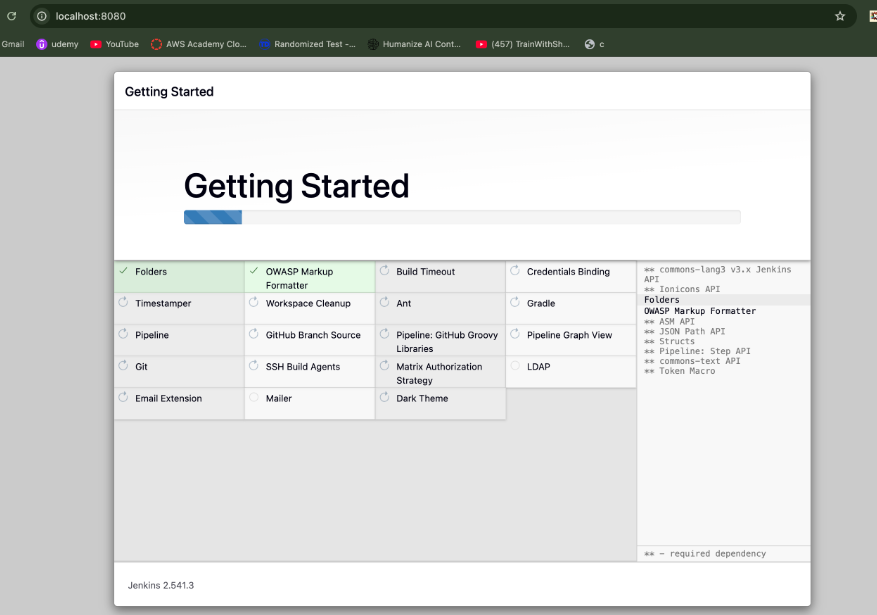
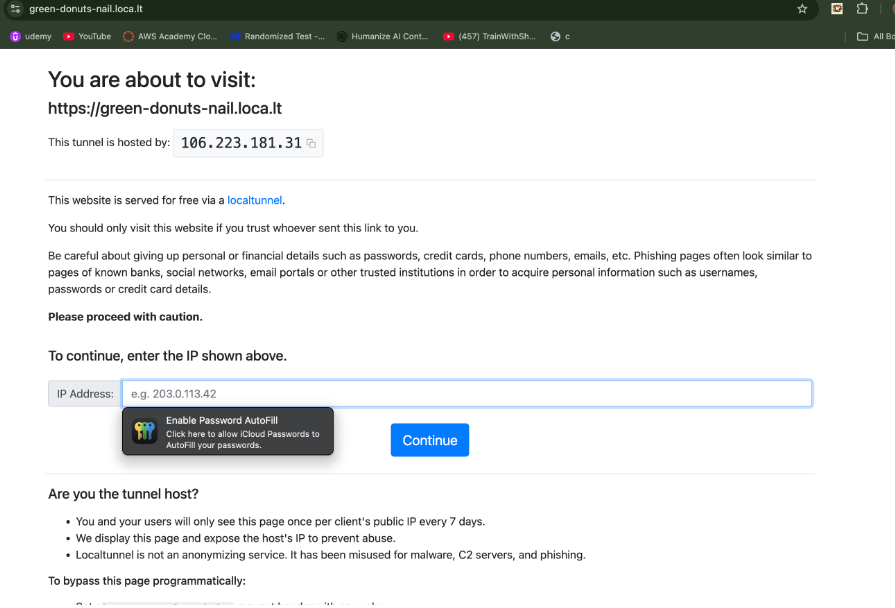

# Experiment 7: CI/CD Pipeline using Jenkins, GitHub and Docker Hub

## Aim

To implement a CI/CD pipeline using Jenkins integrated with GitHub and Docker Hub.

---

## Tools Used

* Jenkins (Docker container)
* GitHub (source code)
* Docker & Docker Compose
* LocalTunnel (for webhook exposure)

---

## Part A: Jenkins Setup using Docker

### Step 1: Create docker-compose.yml

```yaml
version: '3.8'

services:
  jenkins:
    image: jenkins/jenkins:lts
    container_name: jenkins
    restart: always
    ports:
      - "8080:8080"
      - "50000:50000"
    volumes:
      - jenkins_home:/var/jenkins_home
      - /var/run/docker.sock:/var/run/docker.sock
    user: root

volumes:
  jenkins_home:
```

### Explanation

* Jenkins runs inside Docker
* Docker socket is mounted → Jenkins can run Docker commands directly
* Volume ensures Jenkins data persistence



---

### Step 2: Start Jenkins

```bash
docker compose up -d
```

Access Jenkins at:

```
http://localhost:8080
```

---

## Part B: Initial Jenkins Setup

### Step 3: Install Plugins (Getting Started)

After opening Jenkins, install suggested plugins.



### Observation

Jenkins automatically installs required plugins like:

* Git
* Pipeline
* Docker-related integrations

---

## Part C: Exposing Jenkins using LocalTunnel

Since Jenkins runs locally, GitHub cannot access it directly.
LocalTunnel is used to expose it.

### Step 4: Run LocalTunnel

```bash
npm install -g localtunnel
npx localtunnel --port 8080
```

### Step 5: Access Public URL

LocalTunnel generates a public URL like:

```
https://<random>.loca.lt
```

When opening it, a verification page appears.



### Observation

* Tunnel requires IP confirmation
* This URL is used in GitHub Webhook

---

## Part D: CI/CD Workflow (Concept)

Pipeline flow:

```
Developer → GitHub → Webhook → Jenkins → Build → Docker Hub
```

### Jenkinsfile Role

* Defines pipeline stages:

  * Clone repo
  * Build Docker image
  * Login to Docker Hub
  * Push image

---

## Key Concepts Demonstrated

* Jenkins running via Docker
* Persistent storage using volumes
* Docker socket usage for CI/CD
* Public exposure using LocalTunnel
* Webhook-based automation concept

---

## Result

Successfully:

* Deployed Jenkins using Docker Compose
* Accessed Jenkins dashboard
* Installed plugins
* Exposed Jenkins publicly using LocalTunnel

---

## Notes

* Full CI/CD execution (build + push) is defined in `Jenkinsfile`
* Webhook integration completes automation pipeline
* LocalTunnel is used only for testing (not production)
