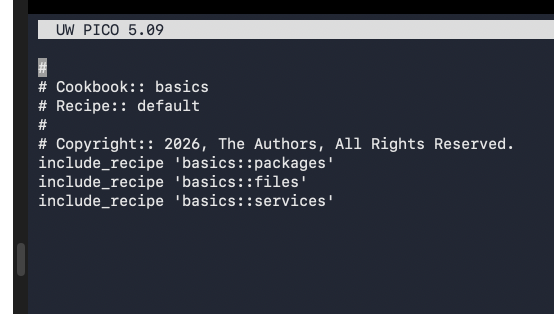
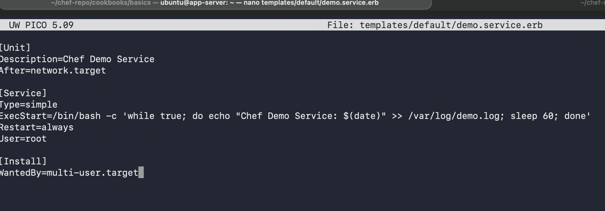

# Experiment 8: Chef – Configuration Management

## Objective

To implement configuration management using Chef (Chef Solo and Chef Server) and automate system setup across multiple nodes.

---

## Part A: Chef Solo (Local Mode)

### Step 1: Install Chef Workstation

```bash
wget https://packages.chef.io/files/stable/chef-workstation/24.10.1144/ubuntu/22.04/chef-workstation_24.10.1144-1_amd64.deb
sudo dpkg -i chef-workstation_24.10.1144-1_amd64.deb
chef --version
```

**Output:**


---

### Step 2: Setup Lab Environment (Docker)

```bash
docker network create chef-lab

ssh-keygen -t rsa -b 4096 -f ~/.ssh/chef-key -N ""

docker build -f Dockerfile.chef -t chef-node .
```

**Output:**


---

### Step 3: Create Docker Nodes

```bash
for i in {1..4}; do
docker run -d \
--name node${i} \
--network chef-lab \
-p 222${i}:22 \
chef-node
done
```

```bash
for i in {1..4}; do
docker exec node${i} mkdir -p /root/.ssh
docker cp ~/.ssh/chef-key.pub node${i}:/root/.ssh/authorized_keys
docker exec node${i} chmod 600 /root/.ssh/authorized_keys
done
```

---

### Step 4: Create First Cookbook

```bash
mkdir -p ~/chef-repo/cookbooks
cd ~/chef-repo
chef generate cookbook cookbooks/basics
```

---

### Step 5: Create Recipes

Created the following recipes:

* `default.rb`
* `packages.rb`
* `files.rb`
* `services.rb`

```ruby
include_recipe 'basics::packages'
include_recipe 'basics::files'
include_recipe 'basics::services'
```

**Output:**



---

### Step 6: Node Inventory & Configuration

* Created `nodes.json`
* Configured `.chef/config.rb`
* Created script `run-chef.sh`

**Output:**



---

### Step 7: Run Chef Solo

```bash
cd ~/chef-repo
./run-chef.sh
```

**Verification:**

```bash
for i in {1..4}; do
ssh -i ~/.ssh/chef-key -p 222${i} root@localhost "cat /opt/chef-demo/README.md"
done
```

---

## Part B: Chef Server (Enterprise Setup)

### Step 1: Setup Chef Server

```bash
docker pull chef/chef-server:latest

docker run -d \
--name chef-server \
--network chef-lab \
-p 443:443 \
chef/chef-server:latest
```

**Output:**


---

### Step 2: Configure Knife

```bash
knife ssl check
knife client list
```

**Output:**


---

### Step 3: Create Advanced Cookbook (Web App)

* Installed Nginx
* Configured reverse proxy
* Deployed Node.js app

```bash
chef generate cookbook cookbooks/webapp
```

**Output:**


---

### Step 4: Bootstrap Nodes

```bash
for i in {1..4}; do
knife bootstrap localhost \
--ssh-user root \
--ssh-port 222${i} \
--ssh-identity-file ~/.ssh/chef-key \
--node-name node${i} \
--run-list 'recipe[webapp]'
done
```

**Output:**


---

### Step 5: Verify Configuration

```bash
knife node list
knife status
```

```bash
for i in {1..4}; do
curl -s http://localhost:222${i}
done
```

**Output:**


---

## Observations

* Chef follows a pull-based model
* Recipes are idempotent
* Chef Server provides centralized control
* Chef Solo is simpler but limited

---

## Result

Successfully implemented Chef-based configuration management:

* Chef Solo for local execution
* Chef Server for centralized orchestration

---

## Conclusion

Chef enables infrastructure automation using a powerful Ruby-based DSL and is suitable for enterprise environments.

---

## Author

* Name: Armaan Arora
* SAP ID: 500124414
