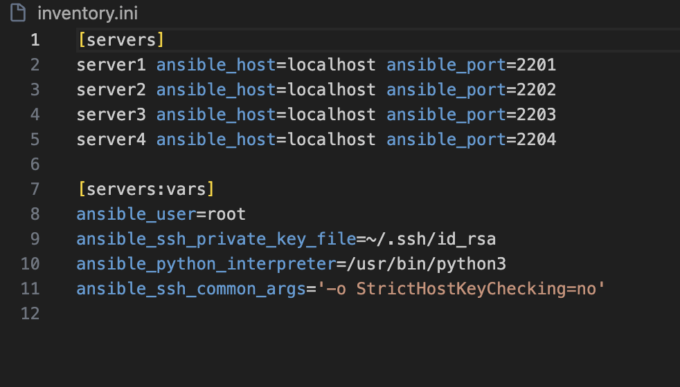

# Experiment 9: Ansible – Configuration Management and Automation

## Objective

To automate configuration management using Ansible by setting up multiple servers, creating inventory, running playbooks, and verifying changes.

---

## Step 1: Install Ansible

```bash
pip install ansible
ansible --version
```

Verify installation:

```bash
ansible localhost -m ping
```

---

## Step 2: Create SSH Key Pair

```bash
ssh-keygen -t rsa -b 4096
cp ~/.ssh/id_rsa.pub .
cp ~/.ssh/id_rsa .
```

---

## Step 3: Create Docker Image (Ubuntu SSH Server)

```dockerfile
FROM ubuntu
RUN apt update -y
RUN apt install -y python3 python3-pip openssh-server
```

```bash
docker build -t ubuntu-server .
```

---

## Step 4: Launch 4 Server Containers

```bash
for i in {1..4}; do
docker run -d --rm -p 220${i}:22 --name server${i} ubuntu-server
done
```

---

## Step 5: Create Ansible Inventory

```bash
echo "[servers]" > inventory.ini

for i in {1..4}; do
docker inspect -f '{{range.NetworkSettings.Networks}}{{.IPAddress}}{{end}}' server${i}
done
```

```bash
cat << EOF >> inventory.ini
[servers:vars]
ansible_user=root
ansible_ssh_private_key_file=~/.ssh/id_rsa
ansible_python_interpreter=/usr/bin/python3
EOF
```

**Output:**



---

## Step 6: Test Connectivity

```bash
ansible all -i inventory.ini -m ping
```

**Output:**


---

## Step 7: Create and Run Playbook (update.yml)

```yaml
---
- name: Update and configure servers
  hosts: all
  become: yes

  tasks:
    - name: Update apt packages
      apt:
        update_cache: yes
        upgrade: dist

    - name: Install required packages
      apt:
        name: ["vim", "htop", "wget"]
        state: present

    - name: Create test file
      copy:
        dest: /root/ansible_test.txt
        content: "Configured by Ansible on {{ inventory_hostname }}"
```

Run:

```bash
ansible-playbook -i inventory.ini update.yml
```

**Output:**


---

## Step 8: Create Advanced Playbook (playbook1.yml)

```yaml
---
- name: Configure multiple servers
  hosts: servers
  become: yes
```

Run:

```bash
ansible-playbook -i inventory.ini playbook1.yml
```

---

## Step 9: Verify Changes

```bash
ansible all -i inventory.ini -m command -a "cat /root/ansible_test.txt"
```

OR

```bash
for i in {1..4}; do
docker exec server${i} cat /root/ansible_test.txt
done
```

**Output:**


---

## Step 10: Cleanup

```bash
for i in {1..4}; do
docker rm -f server${i}
done
```

---

## Observations

* Ansible is agentless and uses SSH
* Playbooks are idempotent
* YAML simplifies configuration
* Push-based execution ensures immediate changes

---

## Result

Successfully automated configuration across multiple servers using Ansible.

---

## Conclusion

Ansible provides efficient, scalable, and agentless infrastructure automation using simple YAML-based playbooks.

---

## Author

* Name: Armaan Arora
* SAP ID: 500124414
